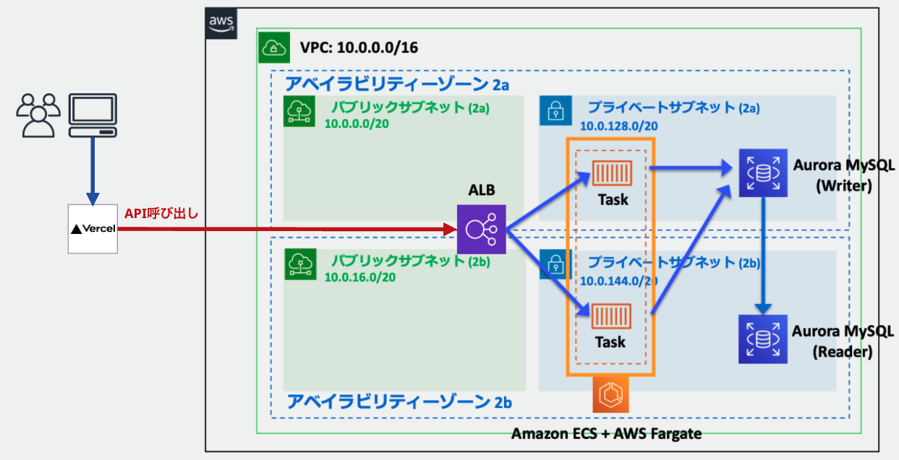

# AI Sales Copy Generator

[](https://ai-sales-copy-generator.click/)
[]()
[]()

## サービス概要

商品の特徴を入力するだけで、ターゲット層や配信チャネルに合わせた販促コピーをAIが生成するWebサービスです。

ECサイトやマーケティング担当者が日々直面している販促コピー作成の課題を解決することを目指しています。商品特徴の入力に基づき、ターゲット層や配信チャネルに合わせたコピーを自動生成します。

### このサービスが解決する課題

- 販促コピー作成に費やす時間と工数の削減
- コピーライティングスキルへの依存軽減
- 様々な商品・サービスに対応したコピー生成
- ターゲット層に合わせたメッセージ最適化

ECプロジェクトでの実務経験から抽出した課題を解決するために開発しました。

## 特徴

- 使いやすいインターフェース設計
- OpenAI APIを活用した自然言語生成
- ターゲット層や配信チャネル別のカスタマイズ
- 生成コピーの保存と管理機能
- レスポンシブデザインによるマルチデバイス対応

## 技術スタック

### フロントエンド
- Next.js 15.2.4: App RouterとServer Componentsを活用
- React 19.0.0: 最新機能を採用したUI実装
- TypeScript: 型安全性を重視したコード設計
- Tailwind CSS 4.0: 効率的なスタイリング
- Jest / Playwright: 自動テストによる品質保証

### バックエンド
- Go 1.21: パフォーマンスを重視したサーバーサイド実装
- Gin: 軽量WebフレームワークによるAPI構築
- GORM: 型安全なORMによるデータ操作
- MySQL 8.0: リレーショナルデータベース
- golang-migrate: マイグレーション管理
- OpenAI API: テキスト生成機能の実装

### インフラ
- AWS (ECS/ALB/RDS): クラウドインフラ構築
- Terraform: インフラのコード化
- Docker: 環境の一貫性確保
- GitHub Actions: CI/CD
- Vercel: フロントエンドデプロイ

## アーキテクチャ

### システム構成



#### インフラ構成の特徴
- VPC内に2つのアベイラビリティーゾーン（2a, 2b）を配置し、可用性を確保
- パブリックサブネット（10.0.0.0/20, 10.0.16.0/20）にALBを配置
- プライベートサブネット（10.0.128.0/20, 10.0.144.0/20）にECSタスクとAurora MySQLを配置
- フロントエンド（Vercel）からバックエンドへのAPI呼び出しはALBを介して実行
- ECSタスクはAWS Fargateで実行され、コンテナの管理を自動化
- Aurora MySQLはWriter/Reader構成で、読み書きの負荷分散を実現

### バックエンド設計

クリーンアーキテクチャを採用し、以下のレイヤー構造で実装しています：

- ドメイン層: 販促コピーやユーザー情報などのビジネスモデル
- ユースケース層: AIとの連携やビジネスロジック
- リポジトリ層: データベースアクセス
- ハンドラー/ルーティング層: APIエンドポイント

## 主要機能

- 商品情報に基づいた販促コピー生成
  - 商品カテゴリに応じたプロンプト設計
  - ブランドトーンの調整

- ユーザー体験
  - 生成コピーの保存と管理
  - 編集・再生成機能
  - レスポンシブデザイン

- 技術的特徴
  - API呼び出しの効率化
  - セキュアなデータ管理
  - スケーラブルな設計

## 開発環境のセットアップ

```bash
# リポジトリのクローン
git clone https://github.com/takanoakira/ai-sales-copy-generator.git
cd ai-sales-copy-generator

# 環境変数の設定
cp backend/.env.example backend/.env
# .envファイルを編集し、OpenAI APIキーなど必要な環境変数を設定

# 開発環境の起動
docker-compose --profile development up -d

# フロントエンド開発サーバー
cd frontend
npm run dev

# バックエンドのテスト実行
cd backend
go test ./...
```

## 今後の展望

- AI機能の改善
  - ユーザーフィードバックを活用した品質向上
  - 特定業種向けの最適化

- 機能拡張
  - 多言語対応
  - SNS投稿用画像生成連携

- 分析機能
  - コピーパフォーマンス追跡
  - 改善提案機能

## 作者

髙野 晃（Akira Takano）

EC業界での実務経験から得た知見を活かし、友人が担当しているマーケティング現場の課題解決に取り組んでいます。